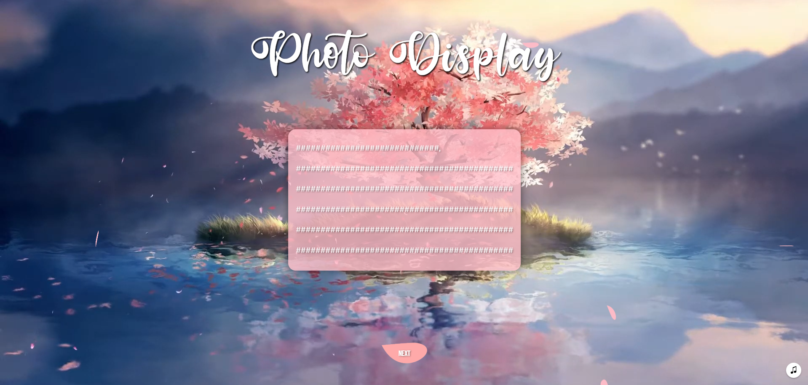
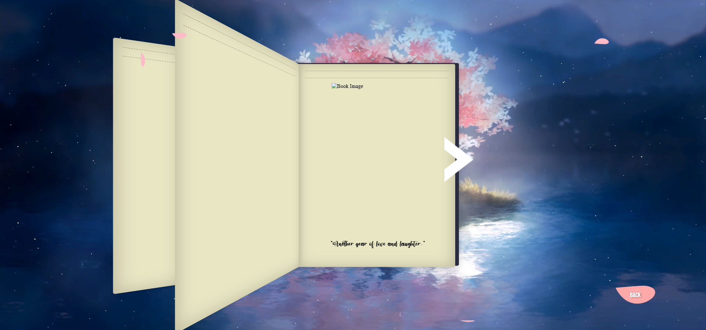

# Photo-Display-Website
A Website that's built with a very artistic design only meant to display pictures and a heartwarming message to anyone you want to make it for


**Preview:**




---

## How It’s Made

**Used:** HTML, CSS, Flask (Python)  

* **Flask router** – `main.py` connects to (`/`, `/cake`, `/memory`, `/places`, `/menu`), each returning a different HTML page
* **Front-end** – every page is a template under `templates/`  
* **Media design** – background with **videos**, **images** and **audio** autoplay to set the mood  

---

## Lessons Learned 

* Learned the basics of using CSS designs from others to create something better
* Background videos are great but don't work so great on web, using CSS to make a design would've been way better 
* How Audio works on web pages and its limitations

---

## Getting Started

```bash
# 1. Clone
git clone https://github.com/Umar-Ansari-X/Photo-Display-Website.git
cd Photo-Display-Website

# 2. Install  Flask
pip install flask

# 3. Run
python main.py 
